# Active Directory Lab

## 📌 Project Overview

This project simulates a real enterprise network using virtual machines.

## 🧱 Lab Architecture

* Domain Controller: Windows Server 2025
* Client Machine: Windows 10
* Network: Host-only (internal network)

## ⚙️ Technologies Used

* VMware Workstation
* Windows Server 2025
* Windows 10

# 🔹 Part 1: Windows Server Installation

## 📸 Screenshots

### 🖥️ Screen 1: VMware Setup
.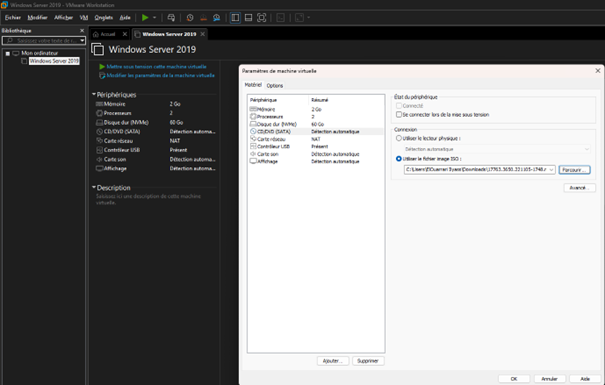

### 🖥️ Screen 2: VM BIOS Configuration

This step shows the virtual machine configuration before installing Windows Server (BIOS, CPU, and system settings).

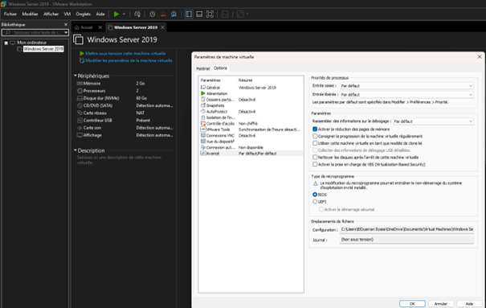

### 🖥️ Screen 3: Windows Boot

This step shows the Windows Server boot process before starting the installation.

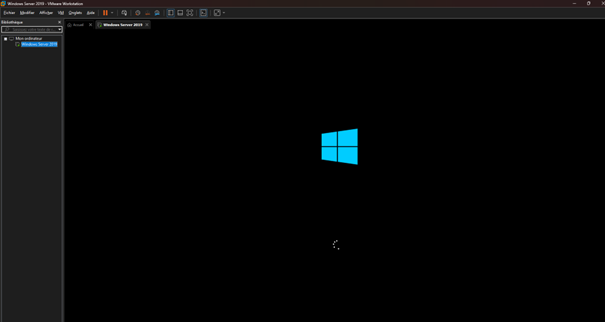

### 🖥️ Screen 4: Windows Server Edition Selection

This step shows selecting the Windows Server 2019 Standard (Desktop Experience) version for installation.

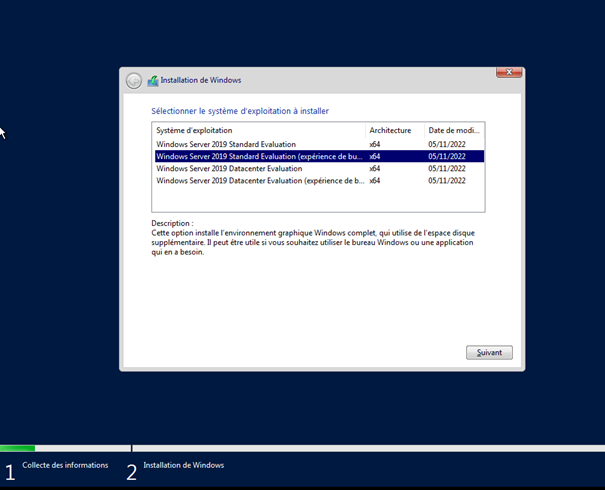

### 🖥️ Screen 5: Windows Server First Boot

This step shows the Windows Server 2019 desktop after successful installation. The system is now ready for initial configuration and role setup.

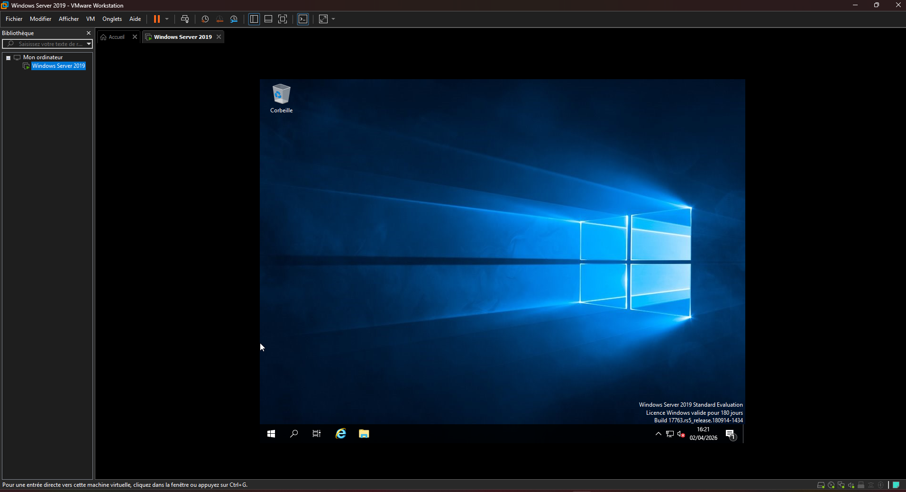

### 🖥️ Screen 5.1: Server Network Configuration

This step shows configuring the Windows Server network settings with a static IP address and DNS for the Domain Controller.

* IP Address: 192.168.56.10
* Subnet Mask: 255.255.255.0
* Preferred DNS Server: 192.168.56.10

This configuration ensures that the server can act as a Domain Controller and DNS server for the network.

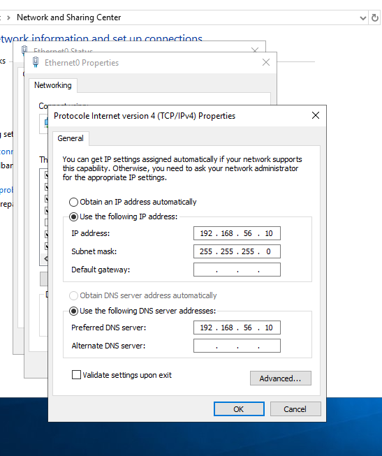

# 🔹 Part 2: Active Directory Configuration

In this part, we install and configure Active Directory Domain Services (AD DS), promote the server to a Domain Controller, and create a domain environment.

---

## 🎯 Objectives

* Install Active Directory Domain Services (AD DS)
* Promote the server to Domain Controller
* Create a domain (lab.local)
* Manage users and organizational units

---

### 🖥️ Screen 6: Server Manager Dashboard

This step shows the Server Manager interface, where we can configure the server and start adding roles and features such as Active Directory.

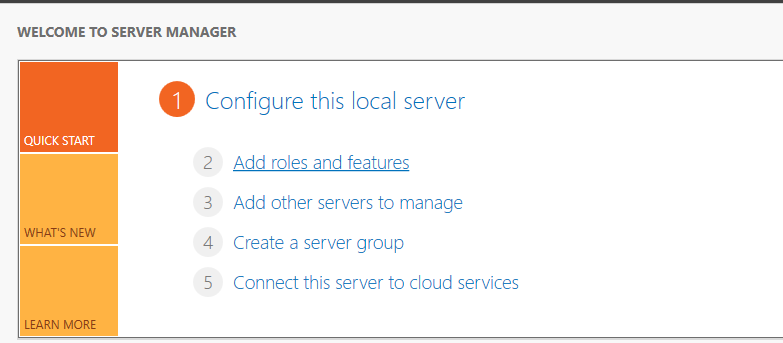

### 🖥️ Screen 7: Add Roles and Features Wizard

This step shows launching the Add Roles and Features wizard.

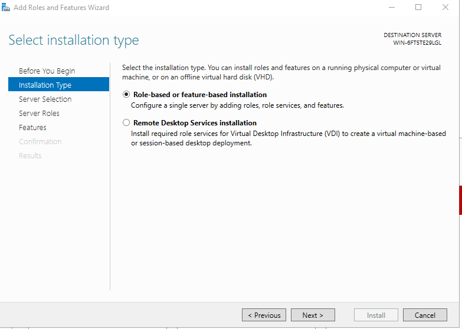

### 🖥️ Screen 8: Active Directory Domain Services Selection

This step shows selecting the Active Directory Domain Services (AD DS) role before installation.

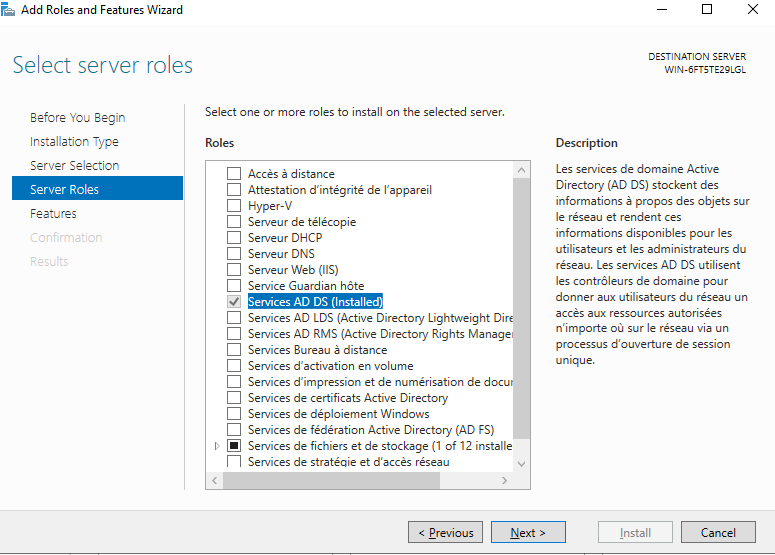

### 🖥️ Screen 9: Confirm Installation

This step confirms the installation of Active Directory Domain Services before starting the installation process.

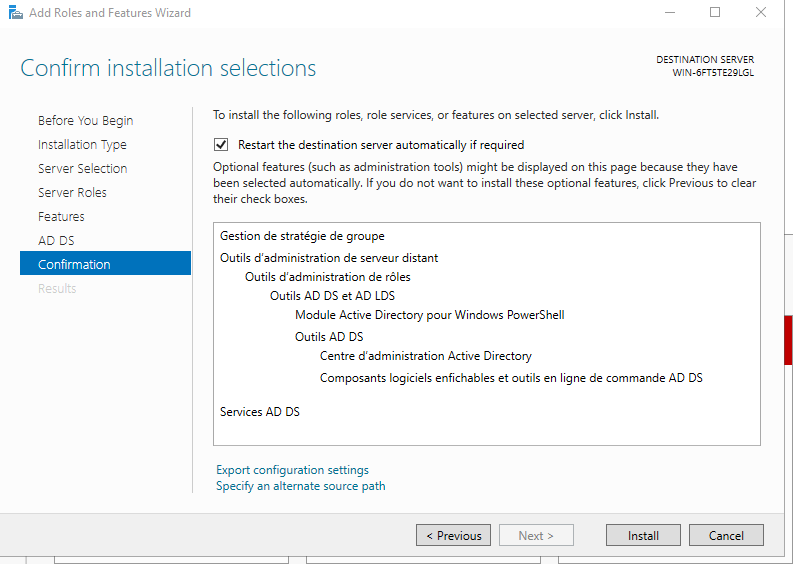

### 🖥️ Screen 10: Promote to Domain Controller

This step shows the option to promote the server to a Domain Controller after installing Active Directory Domain Services.

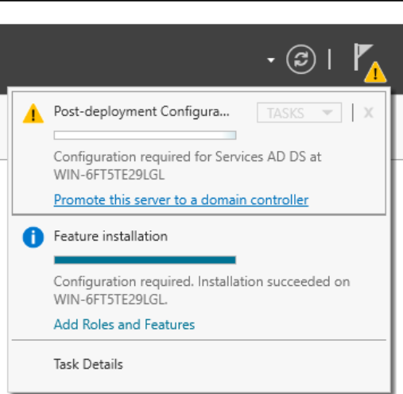

### 🖥️ Screen 11: Domain Controller Installation

This step shows the installation process of promoting the server to a Domain Controller and configuring Active Directory with DNS.

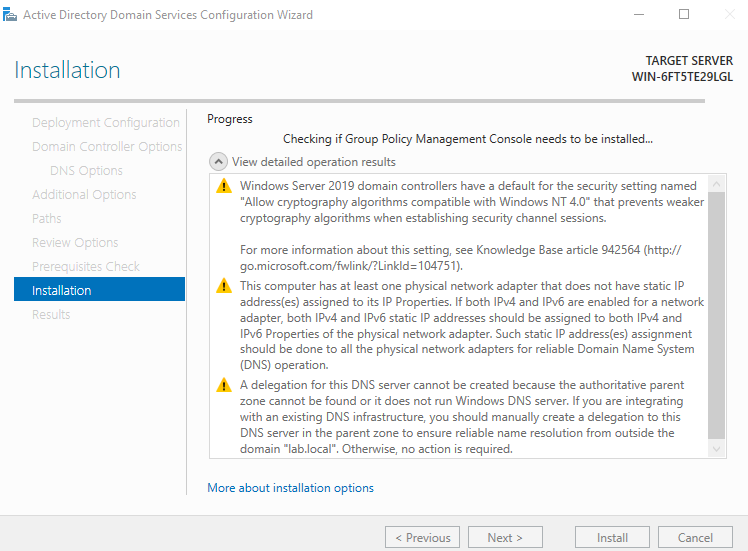

### 🖥️ Screen 12: Domain Controller Login

This step shows logging into the server using the domain account after successful Active Directory configuration.

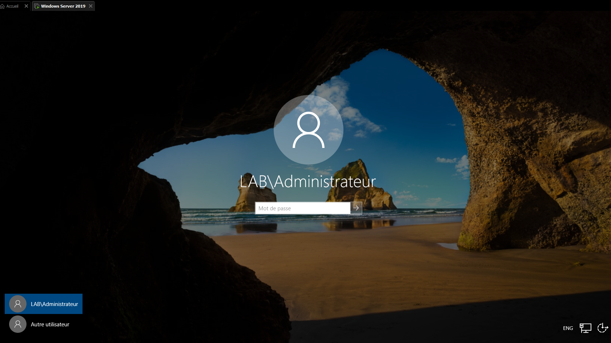

### 🖥️ Screen 13: Active Directory Users and Computers

This step shows opening the Active Directory Users and Computers console to manage domain users, groups, and organizational units.

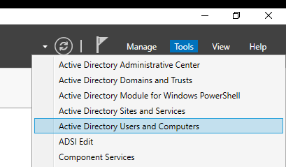

### 🖥️ Screen 14: Create Organizational Units

This step shows creating Organizational Units (OUs) to organize users and resources within the domain.

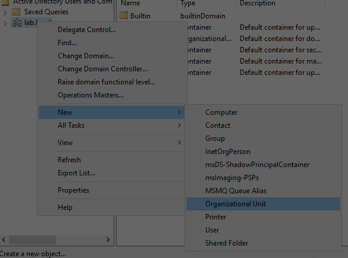

### 🖥️ Screen 15: Create Domain Users

This step shows creating a domain user inside an Organizational Unit.

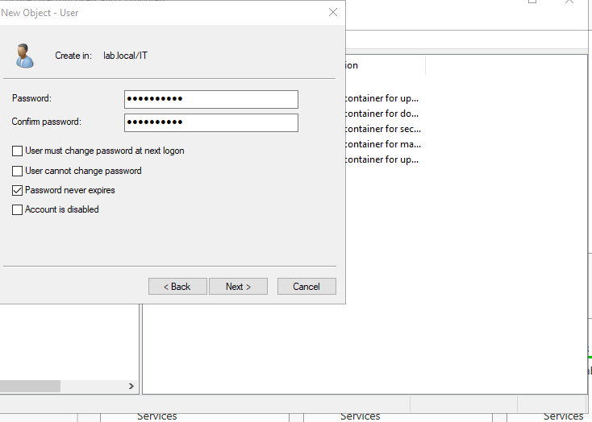

### 🖥️ Screen 17: Windows 10 Edition Selection

This step shows selecting Windows 10 Professional edition for the client machine installation.

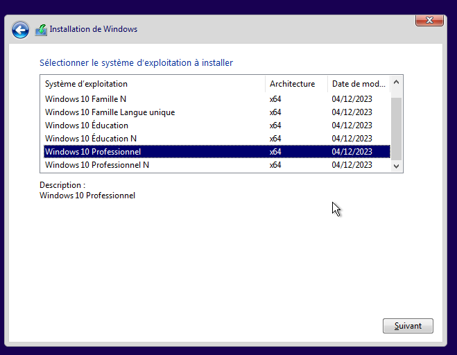

### 🖥️ Screen 18: Windows 10 First Boot

This step shows the Windows 10 desktop after installation. The system is now ready to be configured and joined to the domain.

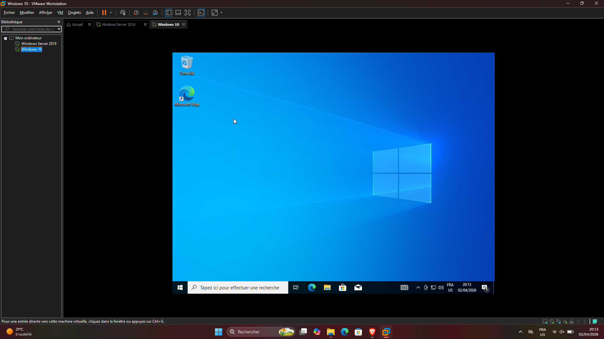

### 🖥️ Screen 18.1: Client Network Configuration

This step shows configuring the Windows 10 client network settings manually, including IP address and DNS pointing to the Domain Controller.

* IP Address: 192.168.56.20
* Subnet Mask: 255.255.255.0
* DNS Server: 192.168.56.10 (Domain Controller)

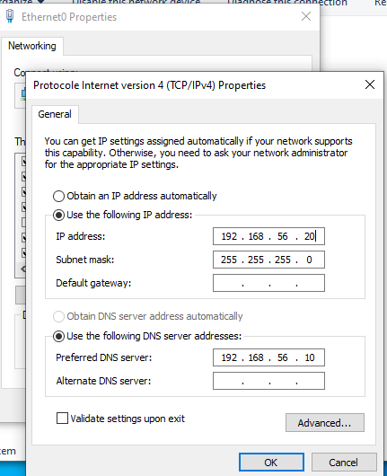

### 🖥️ Screen 19: Join Windows 10 to Domain (Success)

This step shows the process and confirmation of joining the Windows 10 client to the lab.local domain.

  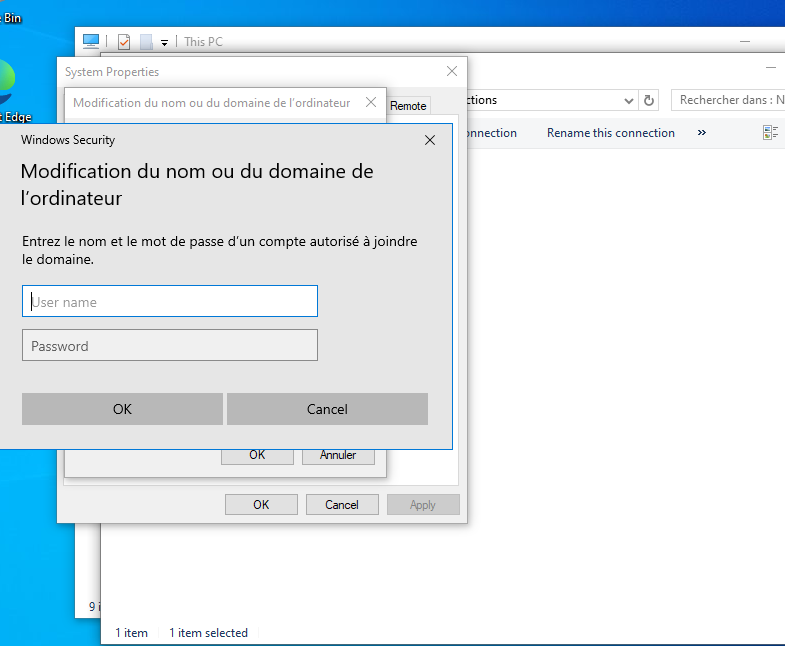
  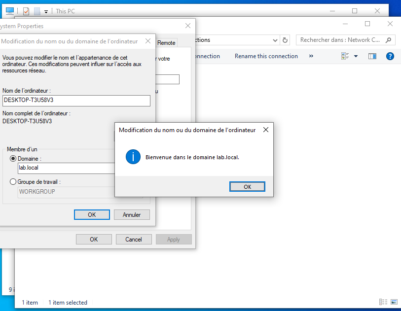

### 🖥️ Screen 20: Domain User Login

This step shows logging into the Windows 10 client machine using a domain user account after successfully joining the lab.local domain.

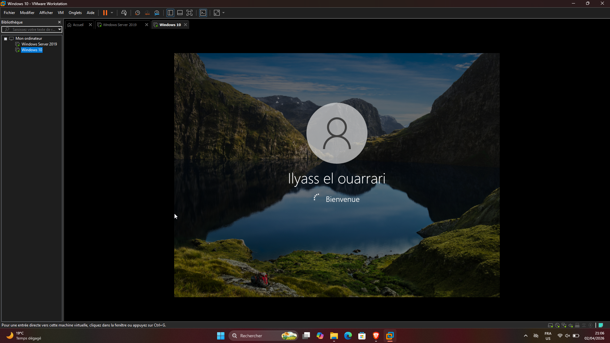
